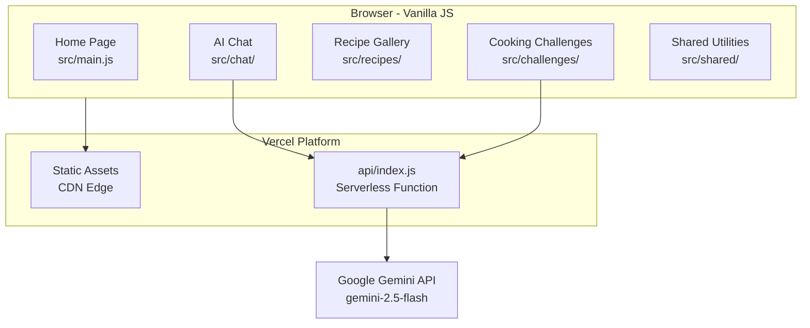

# GastroAI


AI-powered culinary web app featuring real-time cooking challenges, a recipe carousel, and a gastronomy assistant — built with vanilla JavaScript and the Google Gemini API.

**[Live Demo](https://gastro-ai-pap.vercel.app)**

## Features

- **Cooking Challenges** — AI-generated recipes with countdown timer and 4 difficulty levels (Beginner, Intermediate, Advanced, Extreme)
- **AI Chat Assistant** — Specialized gastronomy chatbot with conversation history, chat export, and typing animation
- **Recipe Gallery** — Vertical carousel with 10 international recipes, YouTube video links, and detail modals with Web Share API support
- **Interactive Animations** — Physics-based food animations using Matter.js and GSAP
- **Responsive Design** — Fully responsive across mobile and desktop

## Tech Stack

| Layer | Technology |
|-------|-----------|
| Frontend | HTML5, CSS3, JavaScript (ES6 modules) |
| Animations | GSAP, Matter.js, Anime.js, Typed.js |
| AI | Google Gemini API (gemini-2.5-flash) |
| Backend | Node.js (Vercel Serverless Functions) |
| Testing | Vitest 4, supertest, jsdom |
| CI/CD | GitHub Actions |
| Deployment | Vercel |

## Architecture



## Getting Started

### Prerequisites

- Node.js >= 16
- A [Google AI Studio](https://aistudio.google.com/app/apikey) API key

### Installation

```bash
# Clone the repository
git clone https://github.com/KennedySilva8907/GASTRO-AI-PAP.git
cd GASTRO-AI-PAP

# Install dependencies
npm install

# Configure environment variables
cp .env.example .env
# Edit .env and add your GEMINI_API_KEY

# Start the development server
npm run dev
```

Open [http://localhost:3000](http://localhost:3000) in your browser.

## Environment Variables

| Variable | Description | Required |
|----------|-------------|----------|
| `GEMINI_API_KEY` | Google Gemini API key from [AI Studio](https://aistudio.google.com/app/apikey) | Yes |
| `PRODUCTION_URL` | Production domain for CORS whitelist (e.g., `https://gastro-ai-pap.vercel.app`) | No (only localhost origins allowed if unset) |

See [`.env.example`](.env.example) for reference.

## Testing

```bash
# Run tests
npm test

# Run tests in watch mode
npm run test:watch

# Run tests with coverage report
npm run test:coverage
```

**Test suite:** 112 tests across 11 test files
**Coverage:** 86% (V8 provider, thresholds: 60% lines/functions/statements, 55% branches)
**CI/CD:** Tests and lint run automatically on every push to `main`/`develop` and on pull requests

### Test Structure

| Module | Test File | Description |
|--------|-----------|-------------|
| API | `tests/integration/api/handler.test.js` | CORS, routing, error codes |
| Recipes | `tests/unit/recipes/share.test.js` | Web Share API + clipboard fallback |
| Recipes | `tests/unit/recipes/lazy-loader.test.js` | IntersectionObserver lazy loading |
| Challenges | `tests/unit/challenges/timer.test.js` | Countdown timer logic |
| Challenges | `tests/unit/challenges/recipe-api.test.js` | Recipe generation API calls |
| Shared | `tests/unit/shared/sanitizer.test.js` | DOMPurify XSS sanitization |
| Shared | `tests/unit/shared/errors.test.js` | Error handling utilities |
| Shared | `tests/unit/shared/constants.test.js` | Shared constants validation |
| Config | `tests/config/html-hints.test.js` | HTML performance hints |
| Config | `tests/config/vercel-headers.test.js` | Vercel caching headers |

## Deployment (Vercel)

1. Fork or clone this repository to your GitHub account
2. Import the project on [Vercel](https://vercel.com)
3. Set environment variables in the Vercel dashboard:
   - `GEMINI_API_KEY` — your Google AI Studio API key
   - `PRODUCTION_URL` — your Vercel project URL (e.g., `https://your-project.vercel.app`)
4. Deploy triggers automatically on every push to `main`

## API Reference

Two serverless endpoints proxy requests to the Google Gemini API. See [docs/api.md](docs/api.md) for full documentation including request/response examples and error codes.

| Endpoint | Method | Purpose |
|----------|--------|---------|
| `/api/chat` | POST | AI chat assistant (conversation with history) |
| `/api/gemini` | POST | Recipe generation for timed challenges |

## Project Structure

```
gastro-ai/
├── index.html                # Landing page
├── style.css                 # Global styles
├── api/
│   └── index.js              # Serverless function (Gemini API proxy)
├── src/
│   ├── main.js               # Home page module
│   ├── chat/                  # AI chat modules
│   │   ├── index.js
│   │   ├── handlers.js
│   │   └── matter-setup.js
│   ├── recipes/               # Recipe gallery modules
│   │   ├── index.js
│   │   ├── carousel.js
│   │   ├── lazy-loader.js
│   │   ├── preloader.js
│   │   └── share.js
│   ├── challenges/            # Cooking challenge modules
│   │   ├── index.js
│   │   ├── timer.js
│   │   ├── recipe-api.js
│   │   └── ui.js
│   └── shared/                # Shared utilities
│       ├── constants.js
│       ├── sanitizer.js
│       ├── errors.js
│       └── animations.js
├── chat/                      # Chat HTML page
├── recipes/                   # Recipes HTML page
├── challenges/                # Challenges HTML page
├── tests/                     # Test suite
├── docs/                      # Documentation
├── .github/workflows/         # CI/CD pipeline
├── vercel.json                # Vercel routing and caching
├── vitest.config.js           # Test configuration
├── eslint.config.js           # Linting rules
└── package.json
```

## Browser Support

| Feature | Chrome | Edge | Safari | Firefox |
|---------|--------|------|--------|---------|
| AI Chat | Yes | Yes | Yes | Yes |
| Recipe Gallery | Yes | Yes | Yes | Yes |
| Cooking Challenges | Yes | Yes | Yes | Yes |
| Recipe Sharing (native) | Yes | Yes | Yes (iOS) | No |
| Recipe Sharing (clipboard) | Yes | Yes | Yes | Yes |
| Matter.js Animations | Yes | Yes | Yes | Yes |

> Native sharing uses the Web Share API (Chrome, Edge, Safari iOS). On unsupported browsers, the recipe URL is automatically copied to clipboard.

## License

ISC

## Author

**Kennedy Silva**

---

*Built with vanilla JavaScript and the Google Gemini API*
