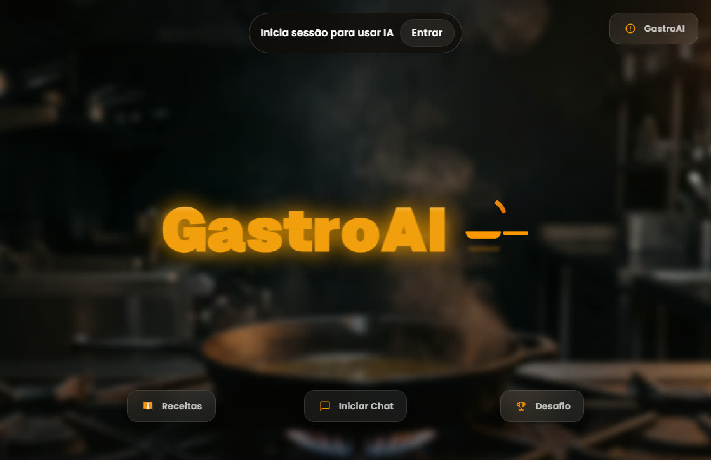
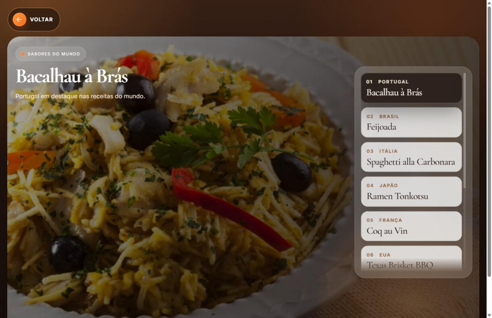
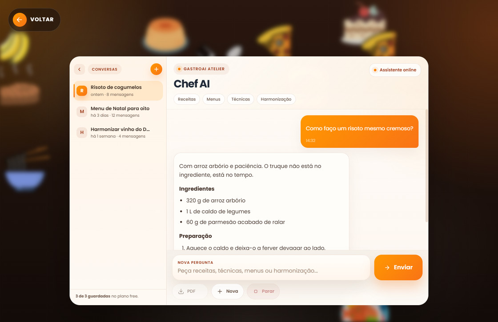
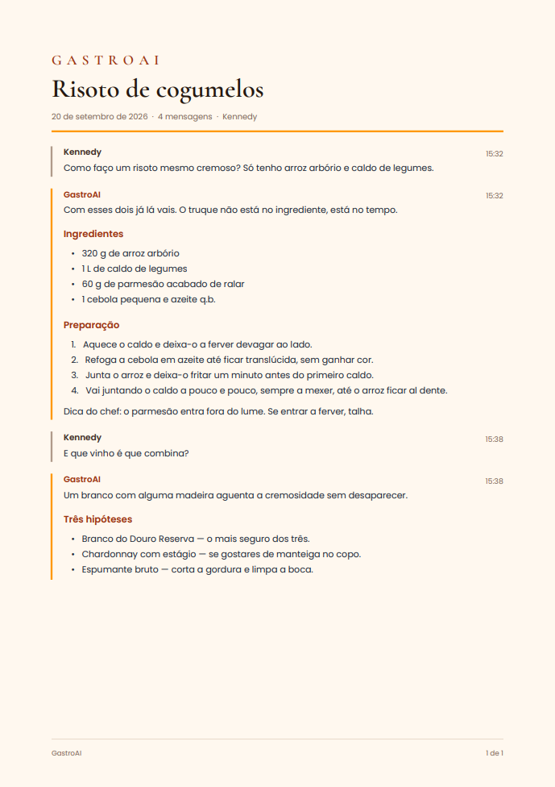
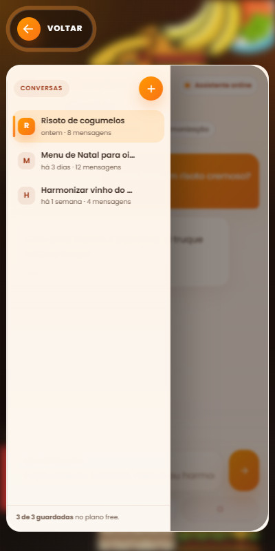
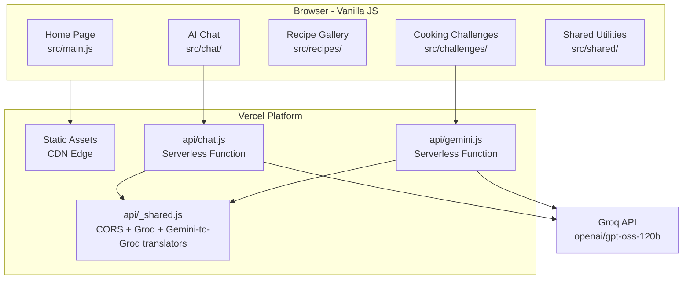

# GastroAI


AI-powered culinary web app featuring real-time cooking challenges, a recipe carousel, and a gastronomy assistant, built with vanilla JavaScript and the Groq API.

**[Live Demo](https://gastro-ai-pap.vercel.app)**

## Screenshots

| Home                                                                                         | Recipe gallery                                                                               |
| -------------------------------------------------------------------------------------------- | -------------------------------------------------------------------------------------------- |
|  |  |

| AI chat with saved conversations                                                                      | Cooking challenges                                                                           |
| ----------------------------------------------------------------------------------------------------- | -------------------------------------------------------------------------------------------- |
|  |  |

| A conversation exported to PDF                                                                     | The list on a phone                                                                              |
| -------------------------------------------------------------------------------------------------- | ------------------------------------------------------------------------------------------------ |
|  |  |

## Features

- **Cooking Challenges** - AI-generated recipes with countdown timer and 4 difficulty levels (Beginner, Intermediate, Advanced, Extreme)
- **AI Chat Assistant** - Specialized gastronomy chatbot with typing animation, saved conversations you can reopen and carry on from, and export to a branded PDF
- **Accounts & Billing** - Supabase Auth, Free/Pro usage limits, Stripe Checkout and Customer Portal. Free keeps three saved conversations and chooses none of them for you
- **Recipe Gallery** - Vertical carousel with 10 international recipes, YouTube video links, and detail modals with Web Share API support
- **Button-anchored Page Transitions** - Pages collapse into the clicked button on exit and expand from the destination button on entry, with an inline head script that bridges the load gap to prevent flashes (`src/shared/transitions.js`)
- **Interactive Animations** - Physics-based food animations using Matter.js and GSAP
- **Responsive Design** - Fully responsive across mobile and desktop

## Tech Stack

| Layer           | Technology                                 |
| --------------- | ------------------------------------------ |
| Frontend        | HTML5, CSS3, JavaScript (ES6 modules)      |
| Animations      | GSAP, Matter.js, Anime.js, Typed.js        |
| AI              | Groq API (`openai/gpt-oss-120b`)           |
| Auth & Database | Supabase Auth + Postgres                   |
| Billing         | Stripe Checkout, Customer Portal, Webhooks |
| Backend         | Node.js (Vercel Serverless Functions)      |
| PDF             | pdfkit, marked (server-side rendering)     |
| Testing         | Vitest 4, supertest, jsdom                 |
| CI/CD           | GitHub Actions                             |
| Deployment      | Vercel                                     |

## Architecture


```mermaid
graph TD
    subgraph Client ["Browser - Vanilla JS"]
        Home["Home Page<br/>src/main.js"]
        Chat["AI Chat<br/>src/chat/"]
        Recipes["Recipe Gallery<br/>src/recipes/"]
        Challenges["Cooking Challenges<br/>src/challenges/"]
        Shared["Shared Utilities<br/>src/shared/"]
    end

    subgraph Vercel ["Vercel Platform"]
        Static["Static Assets<br/>CDN Edge"]
        ChatFn["api/chat.js<br/>Serverless Function"]
        RecipeFn["api/gemini.js<br/>Serverless Function"]
        Shared2["api/_shared.js<br/>CORS + Groq + Gemini-to-Groq translators"]
    end

    Groq["Groq API<br/>openai/gpt-oss-120b"]

    Chat --> ChatFn
    Challenges --> RecipeFn
    ChatFn --> Shared2
    RecipeFn --> Shared2
    ChatFn --> Groq
    RecipeFn --> Groq
    Client --> Static
```

> **Backwards-compatible response shape.** The frontend was originally written
> against the Gemini response envelope (`candidates[0].content.parts[0].text`).
> The serverless functions now talk OpenAI-format to Groq and translate the
> response back into that Gemini envelope so the frontend code did not need
> to change. See [docs/api.md](docs/api.md) for details.

## Getting Started

### Prerequisites

- Node.js >= 18
- A [Groq Console](https://console.groq.com/keys) API key

### Installation

```bash
# Clone the repository
git clone https://github.com/KennedySilva8907/GASTRO-AI-PAP.git
cd GASTRO-AI-PAP

# Install dependencies
npm install

# Configure environment variables
cp .env.example .env
# Edit .env and add your GROQ_API_KEY

# Start the development server (Vercel dev runs the serverless functions)
npm run dev:api
```

Open [http://localhost:3000](http://localhost:3000) in your browser.

## Environment Variables

| Variable                    | Description                                                         | Required                                     |
| --------------------------- | ------------------------------------------------------------------- | -------------------------------------------- |
| `GROQ_API_KEY`              | Groq API key from the [Groq Console](https://console.groq.com/keys) | Yes                                          |
| `SUPABASE_URL`              | Supabase project URL                                                | Yes for V3 auth                              |
| `SUPABASE_ANON_KEY`         | Supabase browser anon key                                           | Yes for V3 auth                              |
| `SUPABASE_SERVICE_ROLE_KEY` | Supabase service role key for server-side writes                    | Yes for V3 auth                              |
| `SUPABASE_JWT_ISSUER`       | Supabase JWT issuer URL (`https://<ref>.supabase.co/auth/v1`)       | Yes for V3 auth                              |
| `STRIPE_SECRET_KEY`         | Stripe secret key                                                   | Yes for V3 billing                           |
| `STRIPE_WEBHOOK_SECRET`     | Stripe webhook signing secret                                       | Yes for V3 billing                           |
| `STRIPE_PRO_PRICE_ID`       | Stripe recurring price ID for Pro                                   | Yes for V3 billing                           |
| `STRIPE_SUCCESS_URL`        | Checkout success redirect URL                                       | Yes for V3 billing                           |
| `STRIPE_CANCEL_URL`         | Checkout cancellation redirect URL                                  | Yes for V3 billing                           |
| `PRODUCTION_URL`            | Production domain for CORS whitelist and billing return URL         | No (only localhost origins allowed if unset) |

See [`.env.example`](.env.example) for reference.

## Testing

```bash
# Run tests
npm test

# Run tests in watch mode
npm run test:watch

# Run tests with coverage report
npm run test:coverage
```

**Test suite:** 233 tests across 27 test files
**Coverage:** V8 provider, thresholds: 60% lines/functions/statements, 55% branches
**CI/CD:** Tests and lint run automatically on every push to `main`/`develop` and on pull requests

### Test Structure

| Module     | Test File                                         | Description                                              |
| ---------- | ------------------------------------------------- | -------------------------------------------------------- |
| API        | `tests/integration/api/handler.test.js`           | CORS, routing, error codes, Groq translation             |
| Chat       | `tests/unit/chat/chat-api.test.js`                | Client-side chat API helpers and history pairing         |
| Recipes    | `tests/unit/recipes/share.test.js`                | Web Share API + clipboard fallback                       |
| Recipes    | `tests/unit/recipes/lazy-loader.test.js`          | IntersectionObserver lazy loading                        |
| Recipes    | `tests/unit/recipes/catalog.test.js`              | Recipe catalog data integrity                            |
| Recipes    | `tests/unit/recipes/carousel-scroll-lock.test.js` | Carousel scroll-lock behavior                            |
| Recipes    | `tests/unit/recipes/panel-controller.test.js`     | Recipe detail panel open/close lifecycle                 |
| Recipes    | `tests/unit/recipes/stage-controller.test.js`     | Stage/featured recipe controller                         |
| Recipes    | `tests/unit/recipes/experience.test.js`           | Top-level recipes experience wiring                      |
| Challenges | `tests/unit/challenges/timer.test.js`             | Countdown timer logic                                    |
| Challenges | `tests/unit/challenges/recipe-api.test.js`        | Recipe generation API calls                              |
| Shared     | `tests/unit/shared/sanitizer.test.js`             | DOMPurify XSS sanitization                               |
| Shared     | `tests/unit/shared/errors.test.js`                | Error handling utilities                                 |
| Shared     | `tests/unit/shared/constants.test.js`             | Shared constants validation                              |
| Shared     | `tests/unit/shared/transitions.test.js`           | Button-anchored page transitions, sessionStorage handoff |
| Smoke      | `tests/unit/smoke.test.js`                        | Top-level smoke check                                    |
| Config     | `tests/config/html-hints.test.js`                 | HTML performance hints                                   |
| Config     | `tests/config/vercel-headers.test.js`             | Vercel caching headers                                   |
| Config     | `tests/config/recipes-design-contract.test.js`    | Recipes page design contract                             |

## Deployment (Vercel)

1. Fork or clone this repository to your GitHub account
2. Import the project on [Vercel](https://vercel.com)
3. Set environment variables in the Vercel dashboard:
   - `GROQ_API_KEY` - your Groq Console API key
   - `PRODUCTION_URL` - your Vercel project URL (e.g., `https://your-project.vercel.app`)
4. Deploy triggers automatically on every push to `main`

### Cache policy (`vercel.json`)

`Cache-Control: immutable` is **only** applied to fingerprinted assets. The
HTML, CSS and JS files at this project use stable paths (no content hash in
the URL), so they are served with `max-age=0, must-revalidate`. Otherwise a
deploy would ship new HTML pointing at a CSS file the browser/CDN already
cached as immutable, breaking the page until the cache expired. Static
fonts/images that _are_ fingerprinted by upstream CDNs keep long caches.

## API Reference

Eleven serverless functions, all of them authenticated except the public Supabase config. See [docs/api.md](docs/api.md) for full documentation including request/response examples, error codes and the migration history.

| Endpoint                     | Method | Purpose                                                     |
| ---------------------------- | ------ | ----------------------------------------------------------- |
| `/api/auth/config`           | GET    | Public Supabase browser configuration                       |
| `/api/auth/session`          | POST   | Authenticated user, plan and daily usage summary            |
| `/api/chat`                  | POST   | Authenticated AI chat assistant (conversation with history) |
| `/api/gemini`                | POST   | Authenticated recipe generation for timed challenges        |
| `/api/conversations`         | GET    | The signed-in user's saved conversations                    |
| `/api/conversations`         | POST   | Start one, or 409 with the list when a free account is full |
| `/api/conversations/:id`     | GET    | A conversation with its messages                            |
| `/api/conversations/:id`     | DELETE | Delete it                                                   |
| `/api/conversations/:id`     | PATCH  | Name it from the first exchange                             |
| `/api/conversations/:id/pdf` | GET    | The conversation as a PDF                                   |
| `/api/billing/checkout`      | POST   | Stripe Checkout session for Pro                             |
| `/api/billing/portal`        | POST   | Stripe Customer Portal session                              |
| `/api/webhooks/stripe`       | POST   | Stripe subscription webhook                                 |

> The `/api/gemini` path is kept for backwards compatibility with the recipe
> client code; the endpoint itself now talks to Groq, not Google.

## Project Structure

```text
gastro-ai/
├── index.html                # Landing page
├── style.css                 # Global styles
├── api/
│   ├── _shared.js            # CORS, preflight, callGroq, Gemini/Groq translators
│   ├── _auth.js              # Supabase JWT verification
│   ├── _usage.js             # Plan resolution and daily limits
│   ├── _conversations.js     # Conversation and message data access
│   ├── _pdf.js               # Markdown to PDF rendering
│   ├── _rate-limit.js        # Per-IP rate limiting
│   ├── _fonts/               # Subsetted Poppins and Cormorant Garamond
│   ├── chat.js               # Serverless function - chat assistant
│   ├── gemini.js             # Serverless function - recipe generation
│   ├── auth/                 # Public config and session summary
│   ├── billing/              # Stripe checkout and customer portal
│   ├── conversations/        # List, read, delete, name, export
│   ├── cron/                 # Daily Supabase health probe
│   └── webhooks/             # Stripe subscription events
├── src/
│   ├── main.js               # Home page module
│   ├── auth/                 # Sign-in pages, account bar, plan cache
│   ├── chat/                 # AI chat modules
│   │   ├── index.js
│   │   ├── handlers.js
│   │   ├── chat-api.js
│   │   ├── conversations-api.js
│   │   ├── conversation-cache.js
│   │   ├── sidebar.js
│   │   ├── limit-dialog.js
│   │   ├── confirm-dialog.js
│   │   ├── pdf-button.js
│   │   └── matter-setup.js
│   ├── recipes/              # Recipe gallery modules
│   │   ├── index.js
│   │   ├── carousel.js
│   │   ├── catalog.js
│   │   ├── lazy-loader.js
│   │   ├── panel-controller.js
│   │   ├── preloader.js
│   │   ├── stage-controller.js
│   │   └── share.js
│   ├── challenges/           # Cooking challenge modules
│   │   ├── index.js
│   │   ├── timer.js
│   │   ├── recipe-api.js
│   │   └── ui.js
│   └── shared/               # Shared utilities
│       ├── animations.js
│       ├── constants.js
│       ├── errors.js
│       ├── sanitizer.js
│       └── transitions.js    # Button-anchored page transitions
├── chat/                     # Chat HTML page
├── recipes/                  # Recipes HTML page
├── challenges/               # Challenges HTML page
├── tests/                    # Test suite
├── docs/                     # Documentation
├── .github/workflows/        # CI/CD pipeline
├── supabase/migrations/      # Schema and row level security
├── vercel.json               # Vercel routing, caching and function config
├── vitest.config.js          # Test configuration
├── eslint.config.js          # Linting rules
└── package.json
```

## Browser Support

| Feature                    | Chrome | Edge | Safari    | Firefox |
| -------------------------- | ------ | ---- | --------- | ------- |
| AI Chat                    | Yes    | Yes  | Yes       | Yes     |
| Recipe Gallery             | Yes    | Yes  | Yes       | Yes     |
| Cooking Challenges         | Yes    | Yes  | Yes       | Yes     |
| Recipe Sharing (native)    | Yes    | Yes  | Yes (iOS) | No      |
| Recipe Sharing (clipboard) | Yes    | Yes  | Yes       | Yes     |
| Matter.js Animations       | Yes    | Yes  | Yes       | Yes     |

> Native sharing uses the Web Share API (Chrome, Edge, Safari iOS). On unsupported browsers, the recipe URL is automatically copied to clipboard.

## License

ISC

## Author

Kennedy Silva

---

Built with vanilla JavaScript and the Groq API
