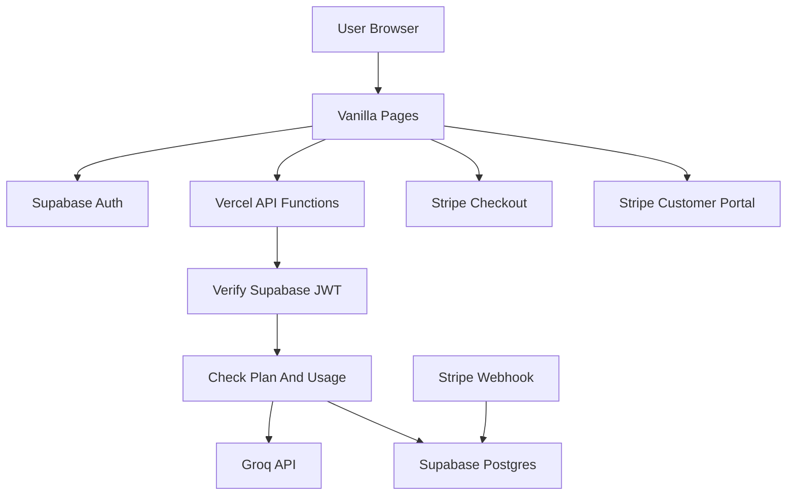

# GastroAI V3 Plan

## Objetivo

Criar a V3 do GastroAI com contas de utilizador, planos Free/Pro, limites de uso por plano e integração de pagamentos, mantendo a base atual em HTML/CSS/JavaScript vanilla com Vercel Serverless Functions.

## Decisões Fechadas

- Autenticação e base de dados: Supabase Auth + Supabase Postgres.
- Pagamentos: Stripe Checkout + Stripe Customer Portal + Stripe Webhooks.
- Modelo comercial inicial: Free + Pro mensal.
- Escopo da V3 inicial: contas + limites de uso. Favoritos, histórico persistente e perfil culinário ficam para V3.1.
- Proteção real: sempre no servidor, antes de chamar a Groq, nunca apenas escondendo botões no frontend.

## Estado Atual Relevante

- Frontend multi-page vanilla: `index.html`, `chat/chatbot.html`, `recipes/receitas.html`, `challenges/desafio.html`.
- Chamadas caras passam por `api/chat.js` e `api/gemini.js`.
- Lógica comum de CORS, payload e Groq está em `api/_shared.js`.
- Limites de uso ainda não existem em produção; `docs/RATE-LIMITING.md` já documenta a necessidade.
- `package.json` tem testes, lint e Vercel dev, mas ainda precisa de Supabase, Stripe e JWT verification.

## Arquitetura Proposta

## Produto V3 Inicial

### Plano Free

- Login obrigatório para usar funcionalidades de IA.
- Chat: 10 mensagens por dia.
- Desafios com IA: 3 receitas por dia.
- Acesso livre ao catálogo estático de receitas.
- UI mostra contador simples de uso restante.

### Plano Pro

- Subscrição mensal via Stripe.
- Chat: 100 mensagens por dia.
- Desafios com IA: 30 receitas por dia.
- Acesso ao Stripe Customer Portal para gerir/cancelar subscrição.
- Badge discreto de plano Pro no cabeçalho.

## Modelo De Dados Supabase

Criar migrations SQL para:

- `profiles`: um registo por utilizador Supabase.
- `subscriptions`: estado da subscrição Stripe ligada ao utilizador.
- `usage_events`: eventos de uso para chat/desafios.
- `daily_usage`: contador agregado por utilizador, data e feature para evitar contar tudo por scan.

Campos essenciais:

- `profiles.id`: UUID igual ao `auth.users.id`.
- `profiles.email`: email de contacto.
- `profiles.created_at`: timestamp.
- `subscriptions.user_id`: FK para profile.
- `subscriptions.stripe_customer_id`: customer Stripe.
- `subscriptions.stripe_subscription_id`: subscription Stripe.
- `subscriptions.status`: `active`, `trialing`, `past_due`, `canceled`, `incomplete`.
- `subscriptions.price_id`: preço Stripe usado.
- `subscriptions.current_period_end`: data de fim do ciclo.
- `daily_usage.user_id`: FK para profile.
- `daily_usage.feature`: `chat` ou `challenge_recipe`.
- `daily_usage.usage_date`: data UTC.
- `daily_usage.count`: contador.

RLS deve ficar ativo nas tabelas. Utilizadores só podem ler o próprio perfil/estado básico; escrita crítica de subscrição e quotas deve ocorrer via server-side com service role.

## Variáveis De Ambiente

Adicionar ao `.env.example` e configurar na Vercel:

- `SUPABASE_URL`
- `SUPABASE_ANON_KEY`
- `SUPABASE_SERVICE_ROLE_KEY`
- `SUPABASE_JWT_ISSUER`
- `STRIPE_SECRET_KEY`
- `STRIPE_WEBHOOK_SECRET`
- `STRIPE_PRO_PRICE_ID`
- `STRIPE_SUCCESS_URL`
- `STRIPE_CANCEL_URL`
- `GROQ_API_KEY`
- `PRODUCTION_URL`

## Endpoints A Criar

- `GET /api/auth/config`: devolve configuração pública do Supabase para o browser.
- `POST /api/auth/session`: valida token atual e devolve perfil, plano e uso diário.
- `POST /api/billing/checkout`: cria Stripe Checkout Session para o plano Pro.
- `POST /api/billing/portal`: cria sessão do Customer Portal.
- `POST /api/webhooks/stripe`: recebe eventos Stripe e atualiza `subscriptions`.

## Endpoints A Proteger

- `api/chat.js`: exigir `Authorization: Bearer <supabase_access_token>`, validar JWT, verificar quota `chat`, incrementar uso e só depois chamar Groq.
- `api/gemini.js`: exigir token, verificar quota `challenge_recipe`, incrementar uso e só depois chamar Groq.
- `api/_shared.js`: adicionar helpers reutilizáveis para auth, resposta `401/403/429`, CORS com header `Authorization`, e preflight compatível.

## Frontend A Criar/Alterar

- Criar `src/auth/client.js` para inicializar Supabase no browser e gerir sessão.
- Criar `src/auth/session.js` para estado de sessão, login/logout e refresh do painel.
- Criar `src/billing/client.js` para chamar checkout/portal.
- Criar `src/shared/api-client.js` para incluir `Authorization` nas chamadas protegidas.
- Atualizar `src/chat/handlers.js` para usar o client autenticado.
- Atualizar `src/challenges/recipe-api.js` para usar o client autenticado.
- Adicionar uma barra de conta discreta nas quatro páginas HTML.
- Estilos partilhados podem começar em `style.css`, com pequenos ajustes locais em `chat/style.css`, `recipes/style.css` e `challenges/style.css`.

## UX Da V3

- Se o utilizador não estiver logado e tentar usar chat/desafio, abrir modal de login em vez de falhar silenciosamente.
- Depois do login, mostrar plano atual e uso restante do dia.
- Quando o Free atingir limite, mostrar CTA para Pro.
- Se Pro estiver `past_due` ou `canceled`, degradar para Free de forma clara.
- O catálogo de receitas continua acessível sem fricção, porque não consome IA.

## Segurança E Abuso

- JWT Supabase deve ser validado server-side usando JWKS ou `supabase.auth.getUser(token)`.
- Nunca confiar no plano enviado pelo browser.
- `SUPABASE_SERVICE_ROLE_KEY` só pode existir em funções server-side.
- Stripe webhook deve verificar assinatura com raw body antes de processar eventos.
- Webhook deve ser idempotente usando `event.id` guardado ou lógica defensiva de upsert.
- Limites devem ser por `user_id`, feature e dia UTC.
- Respostas de limite devem usar `429` com mensagem amigável.

## Eventos Stripe Necessários

Processar no webhook:

- `checkout.session.completed`: ligar Stripe customer ao utilizador e iniciar subscrição.
- `customer.subscription.created`: criar/atualizar subscrição.
- `customer.subscription.updated`: refletir mudanças de estado, preço e período.
- `customer.subscription.deleted`: marcar como cancelada.
- `invoice.payment_failed`: marcar risco/past_due quando aplicável.
- `invoice.paid`: confirmar estado ativo quando aplicável.

## Fases De Implementação

### Fase 1: Fundação Supabase

- Adicionar dependências Supabase/JWT.
- Criar migrations SQL.
- Configurar env vars.
- Criar helper server-side de auth.
- Testar token ausente, token inválido e token válido.

### Fase 2: Quotas Server-Side

- Criar helper `getEntitlements(userId)`.
- Criar helper `checkAndIncrementUsage(userId, feature)`.
- Proteger `/api/chat` e `/api/gemini`.
- Adicionar testes de `401`, `403/429`, Free dentro do limite e Free fora do limite.

### Fase 3: Auth UI

- Adicionar Supabase browser client.
- Criar login/logout simples por magic link ou email/password.
- Adicionar barra de conta nas páginas.
- Adaptar chat/desafios para enviar token.
- Adicionar mensagens de limite e upgrade.

### Fase 4: Stripe

- Criar endpoint de Checkout.
- Criar endpoint do Customer Portal.
- Criar webhook com verificação de assinatura.
- Sincronizar subscrições no Supabase.
- Testar checkout/webhook com payloads simulados.

### Fase 5: Polimento E Lançamento

- Atualizar `README.md`, `docs/api.md` e `docs/RATE-LIMITING.md`.
- Manter este documento como fonte de verdade da V3.
- Rodar `npm test`, `npm run lint` e `npm run format:check`.
- Validar fluxo manual: login, uso Free, limite atingido, upgrade Stripe, Pro ativo, portal, cancelamento.

## Test Plan

- Unit tests para helpers de auth, plano e quotas.
- Integration tests para `/api/chat` e `/api/gemini` com token ausente/inválido/válido.
- Tests para Stripe webhook usando assinatura gerada pelo Stripe SDK.
- Config tests garantindo env vars documentadas e CORS com `Authorization`.
- Smoke test manual no `npm run dev:api`.

## Fora Do Escopo Da V3 Inicial

- Favoritos de receitas.
- Histórico persistente de chat.
- Perfil culinário com alergias/preferências.
- Painel administrativo completo.
- Multi-planos complexos ou planos anuais.
- Migração para React/Next.js.
